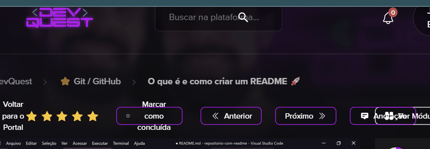

# projeto com readme
um projeto com um arquivo readme 🧬


[](https://gooogle.com)

## tecnologias utilizadas
- Html
- Css
- Js
- React
- Type script
## como utilizar

Clone o projeto 
```
usar apostrofe para abrir e fechar
```
```
assim fica parecendo um código
```
## dificuldades que tive

## o que aprendi 

aqui são exemplos para fazer um readme mais atrativo 

